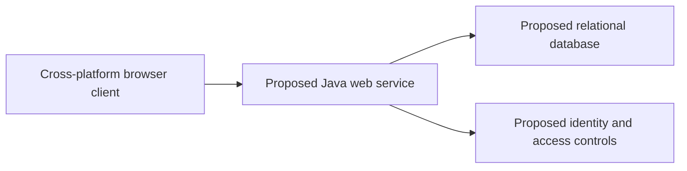

# Draw It or Lose It — Platform Architecture and Java Prototypes

This CS 230 portfolio repository examines how a fictional Android game, *Draw It or Lose It*, could be redesigned as a web-based, cross-platform system. It combines a software-design document with two Java artifacts: an object-oriented game-domain exercise and a Dropwizard REST/authentication scaffold.

> **Status:** Academic architecture work and prototypes. The cloud, database, and client architecture proposed in the design document is not implemented as a complete deployed application in this repository.

## Portfolio artifacts

| Artifact | What it shows | Status |
| --- | --- | --- |
| [Software design document](CS%20230%20Project%20Software%20Design%20Template_Michael_Foster.docx) | Requirements, platform comparison, constraints, distributed-system design, and deployment recommendations | Design proposal |
| [Game-domain model](CS-230-Project-One-main/CS%20230%20Project%20One%20Milestone%20Game%20App/module2/src/com/gamingroom) | Singleton service, entity inheritance, unique identifiers, and game/team/player relationships | Runnable Java learning artifact when opened in a suitable Java project/IDE |
| [GameAuth API scaffold](CS-230-API-Project-main/gameauth) | Dropwizard application structure, REST resources, basic authentication/authorization components, health checks, and an in-memory DAO | Prototype scaffold |

## Implemented Java concepts

### Game-domain model

The domain exercise models games, teams, and players with a shared `Entity` base class. `GameService` uses the Singleton pattern to maintain one service instance, assigns identifiers, and prevents duplicate game names. The exercise demonstrates how object-oriented structure can enforce domain rules before persistence or networking is introduced.

### Dropwizard API scaffold

The `gameauth` project uses Java 8 source compatibility and Dropwizard 2.0.18. Its code includes:

- JAX-RS resources for listing, reading, creating, updating, and deleting game users
- Basic-authentication and role-authorization components
- A Dropwizard health-check endpoint
- An in-memory `HashMap` data store used in place of a durable database
- Maven packaging through the Shade plugin

The API code is a course scaffold, not a complete production service. Data resets when the process restarts, and the repository does not demonstrate the proposed relational database, browser client, cloud deployment, TLS termination, or production identity system.

## Proposed architecture

The design document evaluates operating platforms and recommends a client-server web architecture intended to support multiple devices. It discusses a Java application tier, a browser-based interface, Linux-hosted cloud infrastructure, and relational persistence. Those choices are architectural recommendations for the scenario; they should not be read as deployed features.



## Exploring the code

The domain model can be inspected from its [`ProgramDriver.java`](CS-230-Project-One-main/CS%20230%20Project%20One%20Milestone%20Game%20App/module2/src/com/gamingroom/ProgramDriver.java) entry point. The API scaffold has its own [`pom.xml`](CS-230-API-Project-main/gameauth/pom.xml) and [`config.yml`](CS-230-API-Project-main/gameauth/config.yml).

From the `CS-230-API-Project-main/gameauth` directory, a conventional Dropwizard build is:

```bash
mvn clean package
java -jar target/gameauth-0.0.1-SNAPSHOT.jar server config.yml
```

These commands reflect the committed Maven configuration but have not been freshly verified for this portfolio refresh. Use the prototype only with non-sensitive sample data.

## Competencies demonstrated

- Translating stakeholder needs into requirements and architectural decisions
- Comparing client and server operating platforms
- Applying Singleton and inheritance patterns in Java
- Separating domain, resource, authentication, DAO, and health-check concerns
- Distinguishing a proposed system design from an implemented prototype

<details>
<summary>Development reflection</summary>

Working through the design document before coding helped me reason about user needs, constraints, deployment targets, and tradeoffs without becoming attached to one implementation too early. User stories were particularly useful for identifying who would use the system, what each person needed to accomplish, and why. If revising the submission, I would deepen the Linux-platform comparison and make the evaluation criteria more explicit.

The project reinforced an incremental design process: understand the customer, define requirements, identify constraints, select an architecture, and then choose an appropriate operating environment. It also highlighted why a system should be designed for its intended users rather than for the developer's assumptions.

</details>

## Academic context

Created by Michael Foster for CS 230: Operating Platforms at Southern New Hampshire University. The repositories include instructor-provided scaffolding that was extended as part of the coursework.
